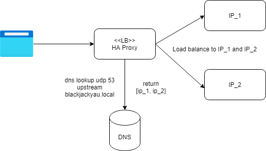
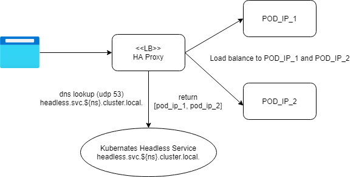

## Setup DNS Service Discovery Load Balancer
- With Cookie based sticky session
- Easily achieved using HA Proxy, in comparison to Nginx Server
    - Nginx Server requires Nginx Plus to support proper sticky session (not considering hashed ip)
    - Nginx Server does not support `resolver` that return a list of IPs for upstream

### DNS Service Discovery on Kubernates
- Using Headless Service as the DNS source

### The Demo Setup
- depends on `bind9 server` from `dns` folder
- to create a shared bridge network between the two compose `docker network create blax-network`
- `docker-compose up` on both `dns` and `ha-proxy`
- refers to [README.MD](../dns/README.MD) for `A record with Multiple IPs` and `SRV Records`
- Unfortunately, service-template will not generate new entry when the `SRV Record` are having the same IPs but diffrerent port
- Example in this demo, HA Proxy will only resolve to either `8888` or `9999` as both of them come from `10.0.2.2`
- `SRV Records Service Discovery` will only come in handly for multiple upstreams with different IP and different ports, else A record is more suitable (less steps)

### References
- [HA Proxy DNS service record](https://www.haproxy.com/documentation/aloha/9-5/traffic-management/lb-layer7/dns-srv-records/)
- [HA Proxy Dynamic Sticky session cookie](https://www.haproxy.com/blog/whats-new-haproxy-1-8/#dynamic-cookies)
- [Write up of HA Proxy on Kube](https://www.securityandit.com/network/haproxy-for-service-discovery-in-kubernetes/)