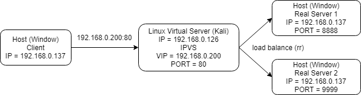
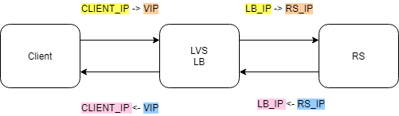

## IPVS Setup
- IPVS is a linux based load balancing and it is not applicable to Window OS
- To test IPVS behaviour on Window OS, we will make use of a Linux Virtual Machine (Kali) to bring up the IPVS server and to route the network to and from Host machine (Window based)

### Setup Diagram

- Linux Virtual Server (LVS) is setup with bridge network
- To ease the development setup, we only use the LVS for load balance purposes

### The Attempts
Recoding down the step by step attempts to further understand the how to we get to the final solution and the why.

#### Initial Setup (following the steps from [here](https://dev.to/douglasmakey/how-to-setup-simple-load-balancing-with-ipvs-demo-with-docker-4j1d))
```bash
apt-get install -y ipvsadm # install ipvsadm
ifconfig eth0:200 192.168.0.200 netmask 255.255.255.255 broadcast 192.168.0.200 # register the VIP on top of eth0 to be accessible by Host/Client (192.168.0.200)
ipvsadm -A -t 192.168.0.200:80 -s rr # create VIP LB entry on IPVS (rr = round robin)
ipvsadm -a -t 192.168.0.200:80 -r 192.168.0.137:8888 -m # Register RS IP on VIP
ipvsadm -a -t 192.168.0.200:80 -r 192.168.0.137:9999 -m # Register RS IP on VIP
```
- `curl` VIP(192.168.0.200) from LVS(Kali) and the connections are working (round robin per connection)]
- `curl` VIP(192.168.0.200) from Client/Host machine and the connections are not working
- Done some inspections using wireshark and the result are as such
```
1628	1.389009623	192.168.0.137	192.168.0.200	TCP	66	14535 → 80 [SYN] Seq=0 Win=64240 Len=0 MSS=1460 WS=256 SACK_PERM=1
1629	1.389036907	192.168.0.137	192.168.0.137	TCP	66	14535 → 8888 [SYN] Seq=0 Win=64240 Len=0 MSS=1460 WS=256 SACK_PERM=1
```
- VIP (200) gets rewrite to RealServer IP (137) and the packet is dropped after that with no SYN-ACK is returned. Suspects this is due to the identical source and dest ip
- To narrow down the issue, we quickly change the Real Server IP to an external IP (taking github 13.250.177.223)
```bash
ipvsadm -C # clear all entries
ipvsadm -A -t 192.168.0.200:80 -s rr # create VIP LB entry on IPVS (rr = round robin)
ipvsadm -a -t 192.168.0.200:80 -r 13.250.177.223:80 -m # Register RS IP on VIP
```
- `curl` VIP(192.168.0.200) from LVS(Kali) and the connections are working (301)
- `curl` VIP(192.168.0.200) from Client/Host machine and the connections are not working
```
3	0.652529337	192.168.0.137	192.168.0.200	TCP	66	31949 → 80 [SYN] Seq=0 Win=64240 Len=0 MSS=1460 WS=256 SACK_PERM=1
4	0.652583107	192.168.0.137	13.250.177.223	TCP	66	31949 → 80 [SYN] Seq=0 Win=64240 Len=0 MSS=1460 WS=256 SACK_PERM=1
5	0.665055467	13.250.177.223	192.168.0.137	TCP	66	80 → 31949 [SYN, ACK] Seq=0 Ack=1 Win=65535 Len=0 MSS=1436 SACK_PERM=1 WS=1024
```
- SYN ACK is return from RealServer (which is good), but the LVS does not dest IP (192.168.0.137) is not availble on the LVS and hence the packet is dropped
- Did some research and found out that we need to perform a Full Nat (SNAT + DNAT) in order to work ([link1](https://blog.dianduidian.com/post/lvs-snat%E5%8E%9F%E7%90%86%E5%88%86%E6%9E%90/), [link2](https://gist.github.com/3Hren/0ad6321693f1114dc3af5f13481b8db3))
- As DNAT is already in place, in order to enable SNAT on IPVS we need to these two commands
```bash
echo 1 > /proc/sys/net/ipv4/vs/conntrack
iptables -t nat -A POSTROUTING -j MASQUERADE
```
- TCP 3 way handshakes are successful this round !!
```
22	1.797110896	192.168.0.137	192.168.0.200	TCP	66	1065 → 80 [SYN] Seq=0 Win=64240 Len=0 MSS=1460 WS=256 SACK_PERM=1
23	1.797171345	192.168.0.126	13.250.177.223	TCP	66	1065 → 80 [SYN] Seq=0 Win=64240 Len=0 MSS=1460 WS=256 SACK_PERM=1
24	1.810827573	13.250.177.223	192.168.0.126	TCP	66	80 → 1065 [SYN, ACK] Seq=0 Ack=1 Win=26883 Len=0 MSS=1440 SACK_PERM=1 WS=128
25	1.810852002	192.168.0.200	192.168.0.137	TCP	66	80 → 1065 [SYN, ACK] Seq=0 Ack=1 Win=26883 Len=0 MSS=1440 SACK_PERM=1 WS=128
26	1.811115672	192.168.0.137	192.168.0.200	TCP	60	1065 → 80 [ACK] Seq=1 Ack=1 Win=132352 Len=0
27	1.811129789	192.168.0.126	54.169.178.190	TCP	54	1065 → 80 [ACK] Seq=1 Ack=1 Win=132352 Len=0
```

- and finally restore to the initial setting (Client and RS the same machine) and it should be working as well

### References
- [simple ipvs demo](https://dev.to/douglasmakey/how-to-setup-simple-load-balancing-with-ipvs-demo-with-docker-4j1d)
- [simple ipvs demo 2](https://dev.to/douglasmakey/how-to-setup-simple-load-balancing-with-ipvs-demo-with-docker-4j1d)
- [different ipvs nat model](https://www.alibabacloud.com/blog/load-balancing---linux-virtual-server-lvs-and-its-forwarding-modes_595724)
- [ipvs full nat](https://blog.dianduidian.com/post/lvs-snat%E5%8E%9F%E7%90%86%E5%88%86%E6%9E%90/)